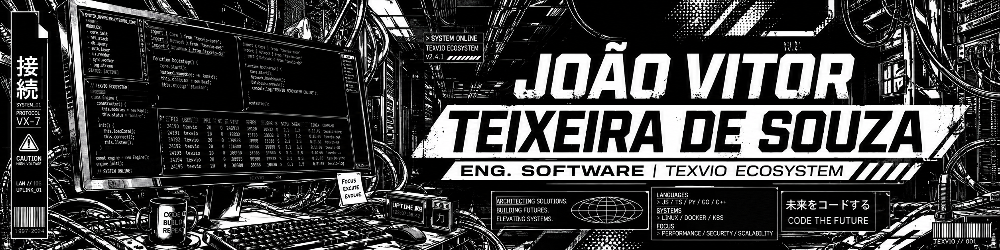
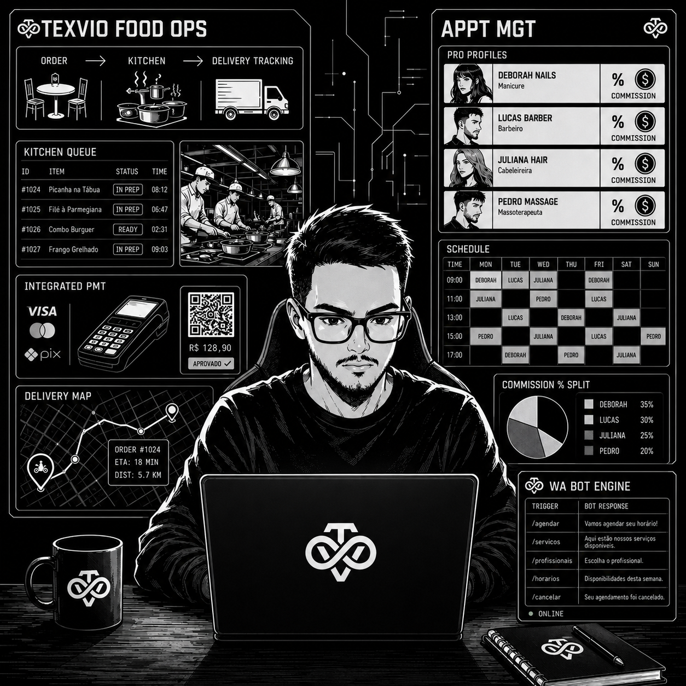

  

 

<h2>Sobre Mim</h2>
<table border="0" width="100%">
  <tr>
    <td width="75%">
      
<b>João Vitor Teixeira de Souza | Arquiteto de Software & Fundador TexVio</b>

      
Engenheiro focado no desenvolvimento de plataformas SaaS (Software as a Service) e soluções corporativas sob encomenda. Lidero a arquitetura de ponta a ponta na <b>TexVio</b>, projetando sistemas para logística, automação e gestão de pagamentos.

      
Minha atuação é voltada para negócios: construo painéis administrativos complexos em PHP/MySQL (GCP e Hostinger) com regras de negócios profundas, garantindo integrações seguras e responsividade cirúrgica nas pontas da operação (dispositivos móveis).  <i>* Nota: Devido a contratos de confidencialidade (NDA) e arquitetura proprietária SaaS, o código-fonte dos meus projetos é mantido em repositórios privados.</i>

    </td>
    <td width="25%" align="center">
      
    </td>
  </tr>
</table>

 

<h2>Produtos & Soluções (Closed Source)</h2>
<table border="0" width="100%">
  <tr>
    <td width="65%">
      <h3>🏢 TexVio (SaaS Ecosystem)</h3>
      
  <b>Texvio Food:</b> Plataforma proprietária de gestão gastronômica comercializada via assinatura. Engloba controle de fluxo de cozinha, integração direta de pagamentos e rastreamento em tempo real de frota de entregas.

      
  <b>Texvio Appointments (Em Desenvolvimento):</b> Motor de agendamento corporativo. Projetado para gerenciar alta concorrência de horários e executar lógicas de split financeiro dinâmico, integrado com bots de atendimento via WhatsApp.

       
      <h3>⚙️ Soluções Corporativas (Sob Encomenda)</h3>
      
  <b>Controle de Fluxo Físico/Digital:</b> Sistema desenvolvido sob demanda para rastreio e liberação de maquinário/equipamentos corporativos. Utiliza a API do Google Wallet para emissão de passes NFC, eliminando a dependência de hardwares legados (catracas/cartões físicos).

      
  <b>Gestão Administrativa Privada:</b> Desenvolvimento de sistemas internos restritos (painéis logados) para controle de fluxo financeiro, estoque e operações logísticas de empresas clientes.

    </td>
    <td width="35%" align="center">
      
    </td>
  </tr>
</table>

 

<h2 align="center">Connect</h2>

  
  
  

